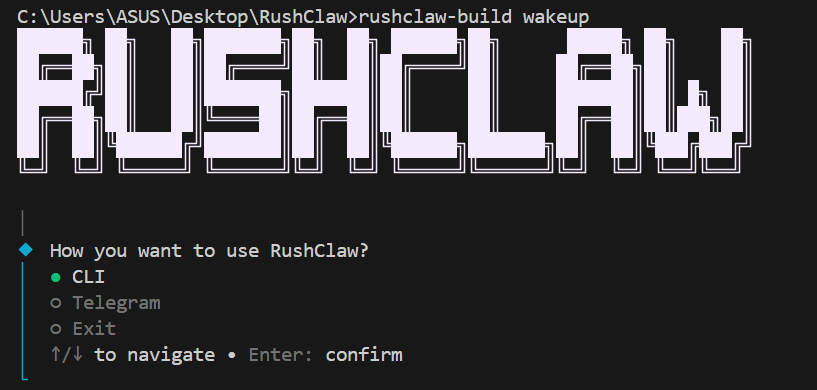
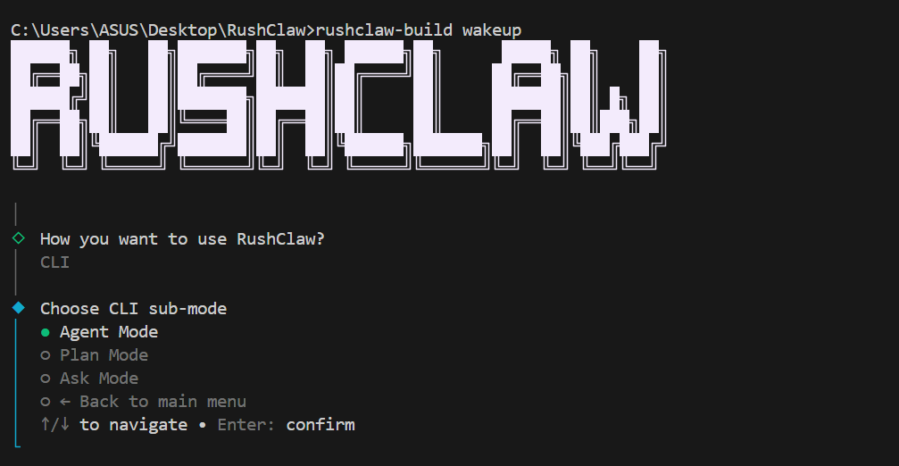

# RushClaw.AI 🦅

<div align="center">

[](https://www.typescriptlang.org/)
[](https://bun.sh/)
[](https://aistudio.google.com/)
[](https://openrouter.ai/)
[](https://sdk.vercel.ai/)
[](https://telegram.org/)

**Autonomous Agentic Coding Assistant & Multi-Mode CLI built with Bun & TypeScript.**  
*Transform natural language prompts into safely staged, approval-gated codebase changes with CLI and Telegram Bot control.*

[Key Features](#-key-features) • [Terminal Output](#-terminal-output--interactive-flow) • [Quickstart](#-quickstart) • [Operating Modes](#-operating-modes) • [Architecture](#-project-architecture)

<br/>

<p align="center">
  
</p>

</div>

---

## ⚡ Overview

**RushClaw.AI** is an intelligent, high-performance developer tool that executes complex software development tasks autonomously while keeping you firmly in control. Built from the ground up using **Bun** and the **Vercel AI SDK**, RushClaw supports **Google Gemini (Google AI Studio)** and **OpenRouter** models, web research via **Firecrawl**, git-style diff previews, and remote operation via a **Telegram Bot**.

Every single codebase mutation (file creation, modification, or directory addition) is staged in-memory, visualized with colored diffs, and requires explicit user approval before touching your disk.

---

## 🚀 Key Features

- 🤖 **Autonomous Agent Mode** — Loops through multi-step reasoning, file inspection, directory tree analysis, and code synthesis.
- 🧭 **Deep Plan Mode** — Researches your goal, analyzes current skills and dependencies, queries live web sources, drafts a 1–15 step plan, and lets you select which steps to execute.
- ❓ **Interactive Ask Mode** — Deep read-only Q&A about code semantics, architecture, or tech stacks with optional Markdown report exporting.
- 📱 **Telegram Bot Integration** — Run Agent, Plan, and Ask modes remotely via Telegram. Features inline buttons for step execution, diff previews, and change approvals.
- 🛡️ **Zero Unapproved Mutations** — Full staging and approval workflow. Inspect visual diffs before applying any changes to your project.
- 🌐 **Web Research & Scraping** — Native web search, URL fetching, and markdown scraping powered by **Firecrawl**.
- 🎨 **Modern Terminal UI** — Retro shadow ANSI banners (via `figlet`), clean interactive prompts (`@clack/prompts`), and full terminal markdown rendering (`marked` + `marked-terminal`).
- ⚡ **Dual AI Engine Support** — Seamlessly runs on **Google Gemini** (1,500 requests/day on Google AI Studio free tier) or **OpenRouter**.

---

## 📸 Terminal Output & Interactive Flow

RushClaw features an interactive, shadow-typography terminal user interface (TUI) with smooth sub-mode navigation, real-time loading spinners, and graceful loopbacks:

<p align="center">
  
</p>

| UI Element | Description |
| :--- | :--- |
| **Dual-Layer ASCII Shadow** | Custom dual-pass banner rendering combining facial foreground and shadow layers. |
| **Interactive Clack Prompts** | Keyboard navigation (`↑`/`↓` and `Enter`) with zero-flicker selection. |
| **Seamless Loopback Flow** | Returning from sub-modes (`← Back to main menu`) gracefully loops back to the launcher. |
| **Real-time Spinners** | Live animated spinners reflecting exact model steps and active tool invocations. |

---

## 📦 Quickstart

### Prerequisites

- [Bun](https://bun.sh/) (v1.2+ installed)
- Google AI Studio API Key *(Recommended)* or OpenRouter API Key

### 1. Clone & Install Dependencies

```bash
git clone https://github.com/yashinrush/RushClaw.AI.git
cd RushClaw.AI
bun install
```

### 2. Configure Environment

Copy `.env.example` to `.env`:

```bash
cp .env.example .env
```

Edit your `.env` file with your preferred API keys:

```env
# Google AI Studio (Recommended - 1,500 free requests/day)
GEMINI_API_KEY=your_gemini_api_key_here
GEMINI_MODEL=gemini-3.5-flash-lite

# Or OpenRouter
OPENROUTER_API_KEY=your_openrouter_api_key_here
OPENROUTER_DEFAULT_MODEL=openrouter/auto

# Optional: Firecrawl Web Search
FIRECRAWL_API_KEY=your_firecrawl_api_key_here

# Optional: Telegram Bot Mode
TELEGRAM_BOT_TOKEN=your_bot_token_from_botfather
TELEGRAM_OWNER_ID=your_numeric_telegram_user_id
```

### 3. Launch RushClaw

Run directly with Bun:

```bash
bun index.ts wakeup
```

Or link globally to use the `rushclaw-build` command anywhere:

```bash
bun link
rushclaw-build wakeup
```

---

## 🕹️ Operating Modes

### 1. 🤖 Agent Mode (`runAgentMode`)
Designed for autonomous execution of complex features and fixes:
- Inspects project structure (`analyze_codebase`, `list_files`, `search_files`, `read_file`).
- Stages new files, updates, or deletions.
- Previews color-coded git diffs (`+` additions in green, `-` deletions in red).
- Prompts for confirmation: `Apply changes? [Yes / No]`.

### 2. 🧭 Plan Mode (`runPlanMode`)
Designed for high-level architectural planning before writing code:
- Analyzes existing workspace context and web sources (if `FIRECRAWL_API_KEY` is present).
- Generates a structured JSON plan with complexity ratings (`low`, `medium`, `high`) and hints.
- Interactive multi-select checklist allows you to pick exactly which steps to run.
- Automatically stops if you decline execution.

### 3. ❓ Ask Mode (`runAskMode`)
Designed for codebase comprehension:
- Read-only queries against your workspace files and skills.
- Renders rich Markdown directly inside your terminal.
- Offers a one-click option to save the discussion into a `.md` summary file.

### 4. 📱 Telegram Mode (`runTelegramMode`)
Full remote access through Telegram:
- Secure owner authentication using your Telegram User ID.
- Commands:
  - `/start` — Welcome message and instructions.
  - `/ask <question>` — Research codebase and stream answer.
  - `/agent <task>` — Run autonomous agent workflow.
  - `/plan <goal>` — Generate interactive plan with inline buttons.
- Inline keyboards to view diffs (`approval_diff`), accept changes (`approval_accept`), or reject (`approval_reject`).

---

## 📁 Project Architecture

```text
RushClaw.AI/
├── ai/
│   ├── ai.config.ts          # Unified AI engine: Google Gemini & OpenRouter provider
│   └── index.ts              # Model exporter
├── modes/
│   ├── agent/                # Autonomous Agent Mode
│   │   ├── action-tracker.ts # In-memory change audit tracker
│   │   ├── agent-tools.ts    # Agent tool definitions (read, write, delete, search, analyze)
│   │   ├── approval.ts       # Human-in-the-loop diff approval prompt flow
│   │   ├── diff-view.ts      # Colored terminal diff renderer
│   │   ├── orchestrator.ts   # Agent loop & execution coordinator
│   │   ├── tool-executor.ts  # Workspace file mutation & staging engine
│   │   └── types.ts          # Agent configuration & tool schemas
│   ├── ask/                  # Codebase Q&A Mode
│   │   └── orchestrator.ts   # Ask loop, read-only tools, & .md persistence
│   ├── plan/                 # Plan Mode
│   │   ├── orchestrator.ts   # Plan workflow & step execution loop
│   │   ├── planner.ts        # Structured plan generator with schema validation
│   │   ├── selection.ts      # Interactive multiselect prompt UI
│   │   ├── types.ts          # Plan & Step data interfaces
│   │   └── web-tools.ts      # Firecrawl search, crawl, & URL fetch tools
│   ├── telegram/             # Remote Telegram Bot Mode
│   │   ├── agent-run.ts      # Telegram-adapted agent & planner loops
│   │   ├── approval-session.ts# Pending approval session state
│   │   ├── auth.ts           # Owner verification guard
│   │   ├── constants.ts      # Help and banner texts
│   │   ├── handlers.ts       # Telegraf command and action callbacks
│   │   ├── index.ts          # Bot runner and graceful lifecycle shutdown
│   │   ├── plan-session.ts   # Interactive plan state and inline keyboards
│   │   └── text.ts           # Markdown text clipping & Telegram formatting
│   └── cli.ts                # Main sub-mode interactive selector
├── tui/
│   ├── terminal-md.ts        # Terminal markdown styling
│   └── wakeup.ts             # ANSI shadow ASCII banner & launcher
├── .env.example              # Environment variables template
├── index.ts                  # CLI entry point (Commander)
├── package.json              # Bun dependencies & scripts
├── tsconfig.json             # TypeScript configuration (Bundler mode)
└── README.md                 # Project documentation
```

---

## 🛡️ Safety & Approval Engine

RushClaw is built with a strict **non-destructive policy**:
1. **Isolated Staging**: When an agent "creates" or "edits" a file, changes are written to an in-memory staging table, NOT directly to your workspace.
2. **Unified Diff Inspection**: All modifications generate visual unified diffs showing exact line-by-line changes.
3. **Explicit Consent**: You must approve staged actions. If you reject them, the staging cache is instantly cleared and your files remain untouched.

---

## 🛠️ Tech Stack & Dependencies

- **Runtime**: [Bun](https://bun.sh/)
- **Language**: [TypeScript](https://www.typescriptlang.org/)
- **AI Providers**:
  - `@ai-sdk/google` (Google Gemini 1.5/2.0/3.5/3.8 Flash & Pro)
  - `@openrouter/ai-sdk-provider` (OpenRouter API)
  - `ai` (Vercel AI SDK Core & ToolLoopAgent)
- **Terminal UI**:
  - `@clack/prompts` (Modern interactive CLI inputs)
  - `chalk` (Terminal coloring)
  - `figlet` (ASCII art banners)
  - `marked` + `marked-terminal` (Rich terminal markdown)
- **Integrations**:
  - `telegraf` (Telegram bot framework)
  - `@mendable/firecrawl-js` (Web crawling & search)
  - `commander` (CLI command routing)
  - `diff` (Unified diff computation)

---

## 🤝 Contributing

Contributions are warmly welcomed!
1. Fork the repository: `https://github.com/yashinrush/RushClaw.AI`
2. Create your feature branch: `git checkout -b feature/amazing-feature`
3. Commit your changes: `git commit -m "Add amazing feature"`
4. Push to your branch: `git push origin feature/amazing-feature`
5. Open a Pull Request.

---

## 📄 License

This project is licensed under the MIT License — see the LICENSE file for details.
